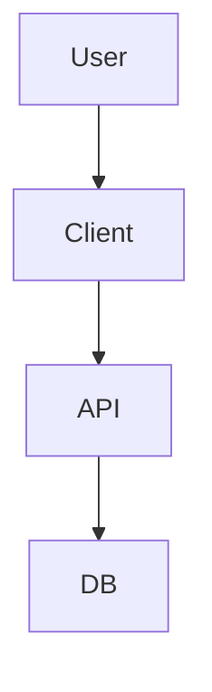

# System Design Blueprint

## Meta
- **Status**: [Draft | Review | Approved]
- **Owner**: [Architect Name]
- **Reviewers**: [List Reviewers]
- **Related PRD**: [Link to PRD]

## 1. Executive Summary
*Briefly describe the system, its purpose, and the problem it solves.*

## 2. Architecture Overview
### 2.1 High-Level Diagram


### 2.2 Component Description
- **Component A**: Description...
- **Component B**: Description...

## 3. Key Decisions & Trade-offs
| Decision | Option A | Option B | Rationale |
| :--- | :--- | :--- | :--- |
| Database | Postgres | Mongo | Relational data requires ACID compliance. |

## 4. API Design
### 4.1 Endpoints
- `GET /resource`: Description
- `POST /resource`: Description

### 4.2 Data Models
```typescript
interface Resource {
  id: string;
  name: string;
}
```

## 5. Non-Functional Requirements
- **Scalability**: Strategy for handling load...
- **Security**: AuthN/AuthZ implementation...
- **Observability**: Metrics and logging strategy...

## 6. Implementation Plan
1.  [ ] Phase 1: Core Infrastructure
2.  [ ] Phase 2: API Implementation
3.  [ ] Phase 3: Frontend Integration
